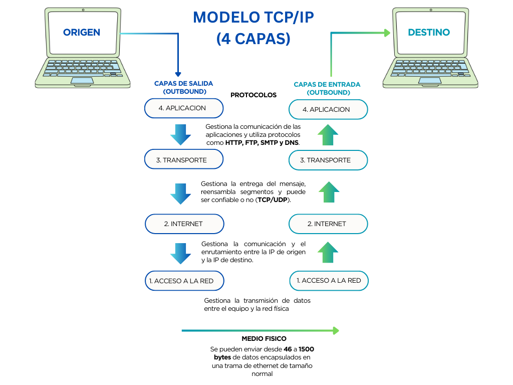
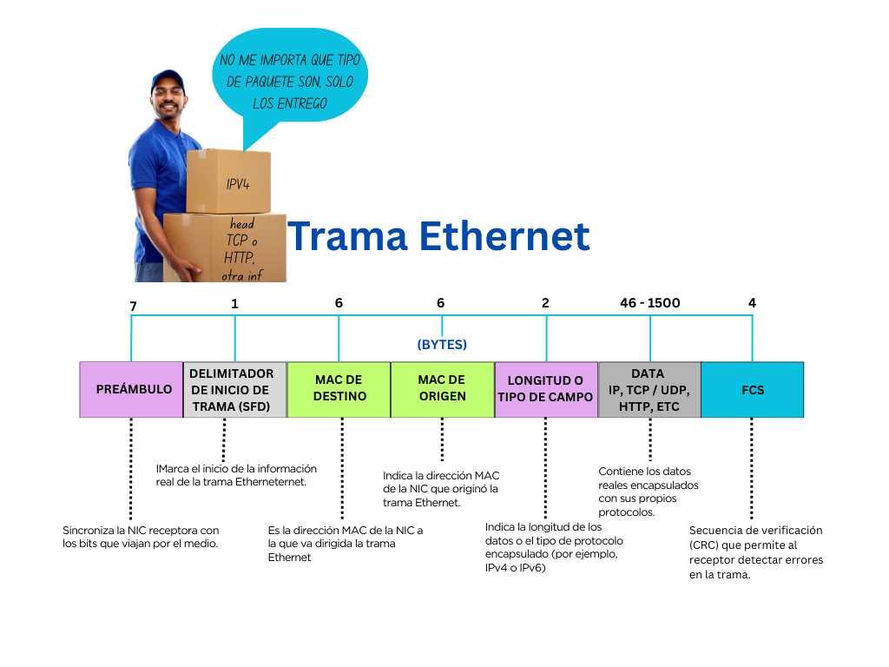
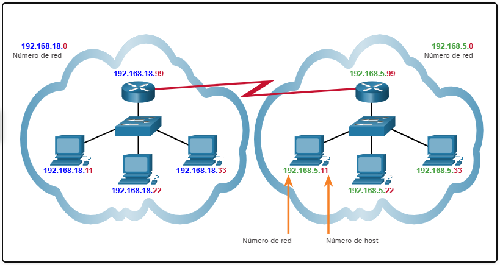

## Tabla de Contenido

- [Qué es rendimiento](#que-es-rendimiento)
  - [Factores](#factores)

- [Dispositivos móviles y WIFI](#dispositivos-móviles-y-wifi)
  - [Alizanza Wifi](#alizanza-wifi)

- [Procolos de comunicación](#procolos-de-comunicación)

- [Estandares](#estandares)

- [Organizaciones de estandares que mantienen el internet](#organizaciones-de-estandares-que-mantienen-el-internet)

- [Modelo TCP/IP](#modelo-tcpip)

- [Los cuatro criterios principales para elegir los medios de red son](#los-cuatro-criterios-principales-para-elegir-los-medios-de-red-son)

- [Tabla de direcciones MAC](#tabla-de-direcciones-mac)

- [Modelo OSI y TPC/IP](#modelo-osi-y-tpcip)
  - [Modelo OSI (Open Systems Inteconnection)](#modelo-osi-open-systems-inteconnection)
  - [Modelo TCP/IP (Transmisión Control Protocol & Internet Protocol)](#modelo-tcpip-transmisión-control-protocol--internet-protocol)
  - [Comparación modelo OSI vs modelo TCP/IP](#comparación-modelo-osi-vs-modelo-tcpip)

- [TABLA DE DIRECCIONES MAC](#tabla-de-direcciones-mac-1)

- [TRAMA ETHERNET](#trama-ethernet)

- [Routing](#routing)

- [DIFUSION](#difusion)

- [MULTIDIFUSIÓN](#multidifusión)

- [TIPOS DE DIRECCIONES IPv4](#tipos-de-direcciones-ipv4)

- [NAT](#nat)

- [CLASES DE REDES](#clases-de-redes)
  - [DIRECCIONES IPv4 Públicas SON ADMINISTRADAS POR LA IANA](#direcciones-ipv4-públicas-son-administradas-por-la-iana)
  - [Intervalos de direcciones IP públicas y privadas](#intervalos-de-direcciones-ip-públicas-y-privadas)

- [Puertos de red (Networking)](#puertos-de-red-networking)
  - [¿Qué es un puerto de red?](#qué-es-un-puerto-de-red)
  - [Rangos de puertos](#rangos-de-puertos)
  - [Protocolos de transporte](#protocolos-de-transporte)
  - [Puertos más comunes y su función](#puertos-más-comunes-y-su-función)
  - [Importancia de los puertos](#importancia-de-los-puertos)
  - [Puertos y seguridad](#puertos-y-seguridad)
  - [Ejemplo práctico](#ejemplo-práctico)
  - [Resumen rápido](#resumen-rápido)
  
---

# Que es rendimiento

Medida de la transferencia de bits que se mide en un determinado periodo de tiempo.

## Factores


# Dispositivos móviles y WIFI

Las precauciones que se deben tomar para proteger las comunicaciones por WiFi en los dispositivos móviles:

+ Nunca envíe información de inicio de sesión o contraseñas a través de texto sin encriptar (texto normal).
+ Use una conexión VPN siempre que sea posible si está enviando datos confidenciales.
+ Habilite la seguridad en las redes domésticas.
+ Utilice WPA2 o un cifrado superior para mayor seguridad.

## Alizanza Wifi
Es la organización responsable de probar los dipositivos LAN inalámbricos de diferentes fabricantes.

# Procolos de comunicación

Permite que dos entidades, sistemas, personas, etc se puedan comunicar estableciendo previamente el método, el idioma y la confirmación del mensaje.


# Estandares
Un estándar de Internet es el resultado final de un ciclo completo de discusión, resolución de problemas y pruebas. Estos distintos estándares son desarrollados, publicados y mantenidos por diferentes organizaciones, tal como se indica en la figura. Cuando se propone un nuevo estándar, cada etapa del desarrollo y del proceso de aprobación es registrada en un documento numerado de solicitud de comentarios (RFC, Request for Comments) para seguir la evolución del estándar. Las RFC para los estándares de Internet son publicadas y administradas por el Grupo de Trabajo de Ingeniería de Internet (Internet Engineering Task Force - IETF).

# Organizaciones de estandares que mantienen el internet


# Modelo TCP/IP


#  Los cuatro criterios principales para elegir los medios de red son:

¿Cuál es la distancia máxima en la que el medio puede transportar una señal exitosamente?

¿Cuál es el entorno en el que se instalarán los medios?

¿Cuál es la cantidad de datos y a qué velocidad deben transmitirse?

¿Cuál es el costo del medio y de la instalación

# Tabla de direcciones MAC

Cuando un host envia un frame a otro host, el switch  registra en su tabla la dirección MAC  de origen y su puerto fisico en el switch. Luego hace una comprobación iterativa puerto por puerto del hasta que coincida con la dirección MAC de destino. 

Caso 1: el host en conectado en el puerto 1 quiere enviar un paquete al host conectaddo en el puerto 4 del switch.
Lo que sucede es que en la tabla de direcciones se registra cada comprobación hasta llegar al puerto 4 donde esta conectado el host y solo en ese momento envia el paquete. La comprobación o comparación en la tabla de direcciones debe hacer 3 iteraciones hasta llegar el puerto 4 donde se encuentra la MAC de destino.


Caso 2: un host conectado en el puerto 4  quiere enviar un paquete al host conectado en el puerto 1, el switch verifica el primer puerto y envia el paquete. La comprobación o comparación en la tabla de direcciones tiene solo una iteración.


Caso 3 (Ya te conozco): se repite el caso 1, pero como en la tabla de direcciones ya hay un registro de un host con una MAC especifica en el puerto 4, el switch envia directamente el paquete sin realizar las comprobaciones en los puerto 2 y 3.


**1. Concentrador (Hub)**

Nivel: Capa 1 (Física).

Función: Repite todo lo que recibe a todos los puertos.

Desventaja: Genera mucho tráfico innecesario; no es seguro ni eficiente.

Solo es posible enviar un mensaje a la vez en un concentrador Ethernet. Dos o más mensajes enviados al mismo tiempo provocarán una colisión. Como el exceso de retransmisiones puede congestionar la red y reducir la velocidad del tráfico de red, ahora los concentradores se consideran obsoletos y fueron reemplazados por conmutadores Ethernet.

A diferencia de un concentrador un switch o conmutador de red envia los datos solo al puerto donde está el destino, gracias a la tabla MAC.

**2. Conmutador (Switch)**

Nivel: Capa 2 (Enlace de datos).

Función: Envía los datos solo al puerto donde está el destino, gracias a la tabla MAC.

Ventaja: Eficiente, seguro y rápido.

Nota: Cuando se habla de “conmutador de red”, normalmente se refiere a un switch. Son lo mismo.


# Modelo OSI y TPC/IP

Permite dividir el capas todo el proceso para poner analizarlo, tambien permite a los fabricantes desarrollar nuevas tecnologia de forma estándar y compatible.

Los procesos que se originan en el dispositivo de origen son de salida y se originan en el dispotivo de destino son los procesos de entrada.

## Modelo OSI (Open Systems Inteconnection)
Creado en el 1980 tiene una arquitectura de 7 capas.
```
7. Aplicación
6. Presentación
5. Sesión
4. Transporte
3. Red
2. Enlace datos
1. Física
```

Al enviar un mensaje este debe atravesar las capas de salida del dispositivo de origen, luego viajar a través de un medio físico de transmisión y por último atravesar las capas de entrada en el dispositivo de destino hasta que el mensaje es entregado.

El Modelo OSI (7 Capas) es el pilar fundamental para entender la arquitectura de las comunicaciones de red, describiendo el flujo de datos desde un origen hasta un destino.
Este modelo está compuesto por siete capas, cada una con responsabilidades específicas en la comunicación. Por ejemplo, en las Capas de Salida (Outbound), la Capa de Transporte (Capa 4) divide los datos en segmentos más pequeños para su envío. Más abajo, la Capa de Red (Capa 3) encapsula esos segmentos en paquetes y define la ruta que deben seguir.
En las capas superiores, la Capa de Sesión (Capa 5) se encarga de gestionar el control, la creación y el formato del mensaje. Finalmente, en el nivel más bajo, la Capa Física (Capa 1) codifica los bits para que puedan transmitirse a través del medio físico.
Dominar las funciones de estas 7 capas es esencial para cualquier profesional de redes, ya que permite comprender cómo los datos son procesados y reensamblados al llegar a la aplicación de destino


>[!Note]
>
>Los terminos segmentos, paquetes, tramas, bits, se refiere a la unidad de datos sobre la cual cada capa ejecuta su proceso.
>
>¿Cuántos datos se pueden encapsular en una trama de Ethernet de tamaño normal antes de que se envíen a través de la red?
>
>46 a 1500 bytes

## Modelo TCP/IP (Transmisión Control Protocol & Internet Protocol)
Creado en la decada de 1970 tiene una arquitectura de 4 capas.

El Modelo TCP/IP (4 Capas) es el estándar que impulsa la comunicación en internet, definiendo cómo los datos viajan desde el origen hasta el destino.
Este modelo de cuatro capas simplifica la arquitectura de red. La Capa de Aplicación (Capa 4) gestiona la comunicación de las apps y utiliza protocolos clave como HTTP, FTP, SMTP y DNS.
Justo debajo, la Capa de Transporte (Capa 3) se encarga de la entrega del mensaje y reensambla los segmentos, determinando si la entrega debe ser confiable o no (TCP/UDP). Por su parte, la Capa de Internet (Capa 2) se focaliza en el routing, gestionando la comunicación y el enrutamiento basándose en la IP de origen y destino.
Comprender estas cuatro capas es fundamental para cualquier profesional de TI que desee dominar la forma en que los datos son transmitidos en la red física.



## Comparación modelo OSI vs modelo TCP/IP


# TABLA DE DIRECCIONES MAC

¿Te has preguntado cómo un Switch gestiona el tráfico de red de manera eficiente, evitando la congestión? La clave está en la Tabla de Direcciones MAC (a veces llamada tabla CAM).
Un Switch Ethernet de capa 2 toma sus decisiones de reenvío basándose únicamente en las direcciones MAC de Capa 2, sin tener conocimiento del paquete o protocolo que se transporta en la trama.
Descubre cómo un Switch construye esta tabla de manera dinámica.
1. Aprendizaje (Learning): El Switch examina la dirección MAC de origen de las tramas entrantes, asociándola al número de puerto por donde ingresó.
2. Reenvío (Forwarding): El Switch busca la dirección MAC de destino en su tabla. Si la encuentra, reenvía la trama al puerto específico; si no la encuentra, se inunda (unidifusión desconocida) a todos los puertos, excepto el de entrada.


# TRAMA ETHERNET

La Trama Ethernet es fundamental en las redes, actuando como la unidad de datos en la Capa de Enlace de Datos (Capa 2) del Modelo OSI,.
Su función principal es encapsular los paquetes de la Capa de Red (Capa 3) y prepararlos para su transmisión a través de la Capa Física,. Un dato clave sobre su capacidad es que una trama de ethernet de tamaño normal puede enviar entre 46 y 1500 bytes de datos,,.
En la práctica, los switches Ethernet de capa 2 utilizan las direcciones MAC que se encuentran en la trama para tomar decisiones de reenvío (o descarte). El switch aprende dinámicamente al examinar la dirección MAC de origen de las tramas que recibe en un puerto,. Esta inteligencia es lo que permite al switch reenviar la trama al puerto correcto, o a todos los puertos (excepto el entrante) si la dirección MAC de destino no está aún en su tabla,.
Dominar la estructura y el comportamiento de las tramas es esencial para entender el funcionamiento de la red local.



# Routing

Con el direccionamiento IPv4 pueden existir varias redes lógicas en una red física, si la porción de red de las direcciones del host correspondiente a la red es diferente. Por ejemplo: tres hosts en una única red local física tienen la misma porción de red en su dirección IPv4 (192.168.18) y otros tres hosts tienen porciones de red diferentes en sus direcciones IPv4 (192.168.5). Los hosts que poseen el mismo número de red en su dirección IPv4 podrán comunicarse entre sí pero no podrán comunicarse con los otros hosts sin utilizar routing.



# DIFUSION
IPv4 utiliza paquetes de difusión. Sin embargo, no hay paquetes de difusión en IPv6.

Dominio de difusión
Identifica todos los host del mismo segmento de red.

Tipos de difusión
Dirigida: la difusión se envia a todos los host de una red especifica.
Limitada: de manera predeterminada los enrutadores no reenvian difusiones.

Dato clave
Segmentar las redes puede mejorar el rendimiento de la red al eliminar el exceso de tráfico de difusión.

# MULTIDIFUSIÓN
Los paquete de multidifusión se envian solo a los host con IPv4 que esten suscritos al grupo de difusión 
en la IP reservada 224.0.0.5. Los routers que soporten el protocolo OSPF permiten enviar paquetes de multifusión
a otros enrutadores.
La dirección IP de multifusión recibe el paquete desde el origen y luego lo envia a cada host suscrito a través
de la unidifusión.

# TIPOS DE DIRECCIONES IPv4

Públicas
Son direcciones que se enrutan globalmente entre routeres de ISP

Privadas
Direcciones usadas en las organizaciones para los host internos.


# NAT
Traduce direcciones privadas a direcciones enrutables en Internet (direcciones públicas).
Esto generalmente se realiza en el router que conecta la red interna a la red ISP. 
Las direcciones IPv4 privadas de la intranet de la organización se traducirán a direcciones IPv4 públicas antes de enrutar a Internet.

# CLASES DE REDES


## DIRECCIONES IPv4 Públicas SON ADMINISTRADAS POR LA IANA  (Autoridad de Números Asignados a Internet)
Los bloques de direcciones son IP se administran a través de los registros regionales de internet RIR. 

En América latina es LACNIC

En Estado Unidos ARIN

Estas direcciones se enrutan de manera global entre los routers ISP.

## Intervalos de direcciones IP públicas y privadas
Su dirección IP privada existe dentro de intervalos específicos de direcciones IP privadas que le reserva la Internet Assigned Numbers Authority (IANA), y nunca debería aparecer en Internet. Hay millones de redes privadas repartidas por el mundo y los dispositivos de todas ellas reciben direcciones IP privadas dentro de estos intervalos:

Clase A: 10.0.0.0 — 10.255.255.255

Clase B: 172.16.0.0 — 172.31.255.255 

Clase C: 192.168.0.0 — 192.168.255.255

---

# Puertos de red (Networking)

## ¿Qué es un puerto de red?
Un **puerto de red** es un número lógico (de `0` a `65535`) que permite identificar **qué servicio o aplicación** está usando una conexión dentro de un dispositivo.

Funciona junto con la **dirección IP** para que los datos lleguen al programa correcto.

- **IP** → identifica el equipo  
- **Puerto** → identifica el servicio dentro del equipo  

Ejemplo:

192.168.1.10:80


Indica un servidor web en ese equipo.

---

## Rangos de puertos

### 1. Puertos bien conocidos (`0–1023`)
- Reservados para servicios estándar  
- Normalmente requieren privilegios de administrador  

### 2. Puertos registrados (`1024–49151`)
- Usados por aplicaciones específicas  
- No están estrictamente reservados  

### 3. Puertos dinámicos o privados (`49152–65535`)
- Usados temporalmente por el sistema operativo  
- Comunes en conexiones cliente  

---

## Protocolos de transporte

### TCP (Transmission Control Protocol)
- Orientado a conexión  
- Garantiza entrega y orden  
- Más confiable, un poco más lento  

### UDP (User Datagram Protocol)
- No orientado a conexión  
- No garantiza entrega  
- Más rápido, menos confiable  

---

## Puertos más comunes y su función

| Puerto | Protocolo | Servicio |
|------|----------|---------|
| 20 / 21 | TCP | FTP – Transferencia de archivos |
| 22 | TCP | SSH – Acceso remoto seguro |
| 23 | TCP | Telnet – Acceso remoto (inseguro) |
| 25 | TCP | SMTP – Envío de correos |
| 53 | TCP / UDP | DNS – Resolución de nombres |
| 80 | TCP | HTTP – Web sin cifrado |
| 110 | TCP | POP3 – Recepción de correos |
| 143 | TCP | IMAP – Correo en servidor |
| 443 | TCP | HTTPS – Web segura |
| 3306 | TCP | MySQL – Base de datos |
| 3389 | TCP | RDP – Escritorio remoto |

---

## Importancia de los puertos
- Permiten que **varios servicios** funcionen en un mismo equipo
- Son fundamentales en:
  - Seguridad
  - Administración de servidores
  - Diagnóstico de red

---

## Puertos y seguridad
- Un **firewall** controla qué puertos están abiertos o cerrados
- Buenas prácticas:
  - Abrir solo los puertos necesarios
  - Cerrar los que no se usan

Ejemplo:
- Servidor web → `80`, `443`
- Acceso remoto → `22` (SSH)

---

## Ejemplo práctico
Cuando escribes:

https://www.ejemplo.com


- El navegador usa el **puerto 443**
- Se establece una conexión TCP segura
- El servidor responde por el mismo puerto

---

## Resumen rápido
- Los puertos identifican servicios
- Van de `0` a `65535`
- **TCP** = confiable  
- **UDP** = rápido  
- La seguridad depende del control de puertos

